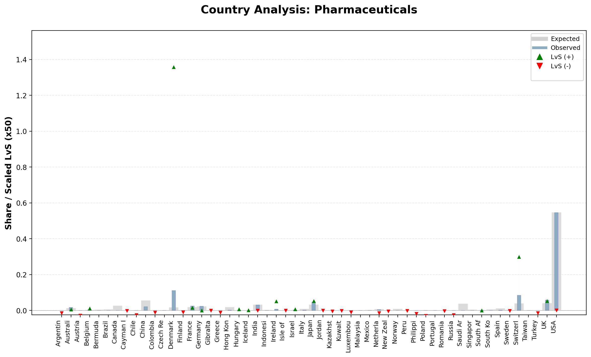
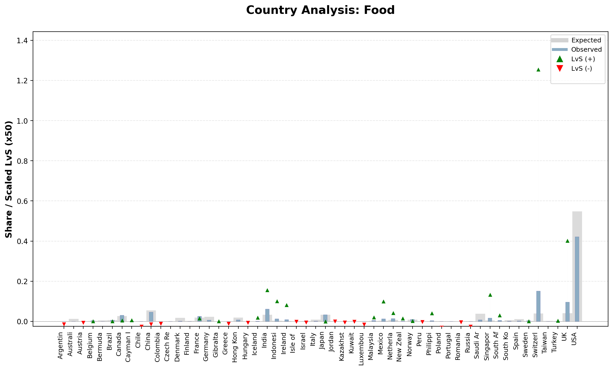

# 📊 LvS for Datasets  
### Learning via Surprisability for Structured Data Analysis


---

## 📑 Table of Contents
- [🔍 Overview](#-overview)
- [✨ What Makes This Different](#-what-makes-this-different)
- [🚀 Quick Start](#-quick-start)
- [⚙️ Parameters](#️-parameters)
- [📂 Input Format](#-input-format)
- [📤 Output Structure](#-output-structure)
- [🧪 Example Visual Outputs](#-example-visual-outputs)
- [⚙️ Configuration File](#️-configuration-file)
- [🧠 Conceptual Background](#-conceptual-background)
- [📌 Notes](#-notes)
- [📄 License](#-license)

---

# 🔍 Overview

**LvS (Learning via Surprisability)** analyzes structured datasets by comparing:
- Expected distributions  
- Observed distributions  
- Surprise signals (LvS)

---

# ✨ What Makes This Different

- Models expectation vs reality gaps  
- Treats absence as signal  
- Aligns with human surprise perception  

---

# 🚀 Quick Start

## What this project does

The repository processes a CSV dataset, computes LvS-oriented outputs, and saves the results locally.

**Main entry point:** `main.py`

**Default output location:** `./results/{dataset}/lvs_results.csv` 

### Run from the command line

You can either:

1. edit a `config.ini` file in advance, or
2. pass parameters directly in the Python command line.

### Example command

```bash
/opt/homebrew/bin/python3.11 /Documents/GitHub/LVS-FOR-DATASETS/main.py   --file_path /Documents/GitHub/LVS-FOR-DATASETS/demo.csv   --dataset market   --agg_column Industry   --entity_name Country   --value_name Marketcap   --output_path results/market/allrenamedlvs.csv   --output_dic results/market/dic.csv   --sig_file results/market/signatures.csv   --graph True   --top 5   --sig_length 70
```

---
# ⚙️ Parameters

| Parameter | Required | Description |
|----------|--------|------------|
| Parameter | Required | Description |
|---|---:|---|
| `file_path` | Yes | Path to the main CSV input file. |
| `dataset` | Yes | Logical dataset name used for organizing outputs. |
| `agg_column` | Yes | First-level aggregation column, for example `Industry`. |
| `entity_name` | Yes | Second-level aggregation column, for example `Country`. |
| `value_name` | Yes | Numeric frequency/value column, for example `Marketcap`. |
| `output_path` | Yes | Output CSV path for processed LvS results. |
| `output_dic` | Yes | Output CSV path for the generated dictionary / mapping file. |
| `sig_file` | Yes | Output CSV path for signatures. |
| `graph` | No | `True` / `False` — whether to generate graphs. |
| `top` | No | Number of top dynamic features to keep. |
| `sig_length` | No | Signature length: number of element values in each signature. |
| `short_names` | No | Whether to encode long source values into shorter labels. |
| `config` | No | Path to `config.ini`. Useful when you prefer configuration-driven execution. |

 

---

# 📂 Input Format

| Industry | Country | MarketCap |
|----------|--------|----------:|
| Retail | USA | 53 |
| Food | Finland | 24 |

---

# Output structure

A typical run creates files under the dataset results directory.

```text
results/
└── market/
    ├── allrenamedlvs.csv
    ├── dic.csv
    └── signatures.csv
```
---

# 🧪 Example Visual Outputs


 
---

# ⚙️ Configuration File Example


```ini
[data]
file_path = documents/demo/real.csv
dataset = market

[proc]
agg_column = Industry
entity_name = Country
value_name = Marketcap

[output]
output_path = results/real/lvs.csv
output_dic = results/real/dic.csv
sig_file = results/real/signatures.csv
graph = True
top = 5
sig_length = 70
short_names = False
```

---
---

# 🧠 Conceptual Background

Insight comes from deviations between expected and observed.

---

# 📄 License

MIT
